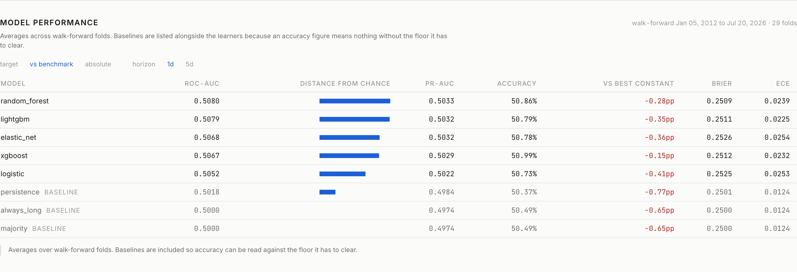
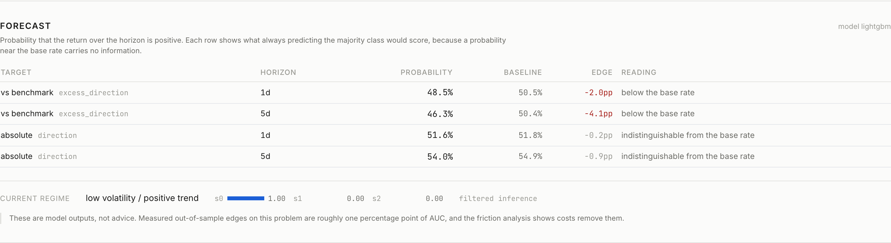
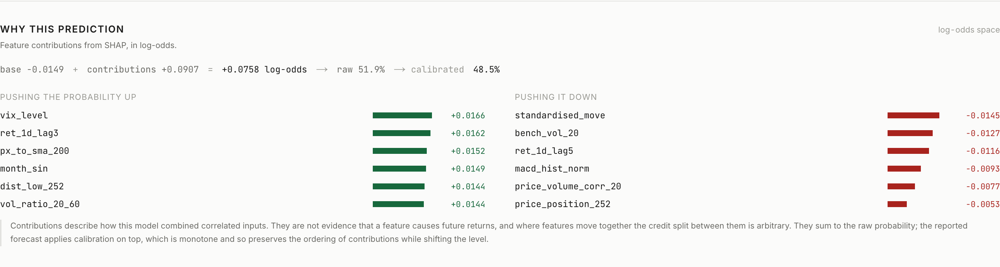

# Short-horizon equity direction forecasting

Can you predict whether a stock closes higher tomorrow? This is an attempt to answer that
properly rather than to get a good-looking number.

The answer is mostly no. Across 29 walk-forward folds and eight models, the best result is
about one percentage point of AUC above chance, and a cost analysis shows that edge
disappears at 6.2 basis points of round-trip friction. Most of the work here went into
establishing that carefully enough to believe it.

**Research and educational software. Not financial advice.**

---

## Why you should distrust a stock predictor claiming 80% accuracy

Search for equity direction prediction and you will find a lot of projects reporting 75 to
99 percent accuracy. Almost all of them have one of four bugs.

| Bug | What actually happens |
|---|---|
| `train_test_split(shuffle=True)` | the model trains on 2024 and is tested on 2015 |
| Scaler fitted before the split | test-set statistics reach the training window |
| Indicators computed before the split | rolling windows straddle the boundary |
| Target built with the wrong shift | the answer becomes an input feature |

There is a fifth failure that is not a bug at all, just a misleading metric. Roughly 55
percent of five-day equity returns are positive, so a model that always predicts "up"
scores 55 percent. Reporting that as accuracy tells you nothing.

This project reports the base rate beside every metric, splits strictly on time, fits every
transformation inside the training window, and ships an audit suite that plants nine
deliberate leaks and requires the tests to catch all of them. A test that can only pass is
not evidence.

## Results

Development universe of 20 tickers, 2006 to 2026, 29 anchored walk-forward folds with
purging and embargo. Every number is out of sample.

| Target | Horizon | Best model | ROC-AUC | Persistence baseline | Base rate |
|---|---|---|---|---|---|
| beat the benchmark | 1 day | random forest | **0.5080** | 0.5018 | 0.4962 |
| beat the benchmark | 5 day | random forest | 0.5056 | 0.5016 | 0.5070 |
| absolute direction | 1 day | random forest | 0.5119 | **0.5129** | 0.5197 |
| absolute direction | 5 day | xgboost | 0.5084 | 0.5024 | 0.5539 |

Three things stand out, and none of them flatter the models.

**A one-line rule beats five machine learning models.** On absolute direction at one day,
predicting that the last move repeats scores 0.5129. The best of five learners, given 58
features and a hyperparameter search, manages 0.5119.

**Accuracy never beats the best constant predictor.** In all 32 model-and-target cells,
accuracy sits below what you would get by always guessing the majority class.

**Only one formulation survives testing.** Predicting whether a stock beats the benchmark
over one day is the single case where the learners are significantly better than the
baselines. Five of five models beat the majority baseline on a paired test across folds
(lightgbm p = 0.0001 after correction), it survives a permutation test that shuffles whole
sessions inside folds, and it replicates across four independent training configurations.
The persistence baseline never sees it, which means it is not simple autocorrelation.

The effect is still tiny. It is about 0.8 points of AUC, accuracy remains below the base
rate, and the friction analysis kills it.

### Does it hold on stocks the model has never seen

Twenty two tickers were held out from the start and scored once, after every modelling
decision was frozen.

Twenty two tickers were held out from the start and scored once, after every modelling
decision was frozen. The model was trained on the twenty development names and applied to
stocks it had never seen, over the same test windows.

| Model | Seen assets | Unseen assets | Change | Folds won | p adjusted |
|---|---|---|---|---|---|
| elastic net | 0.5068 | **0.5067** | -0.0002 | 20/29 | 0.0475 |
| random forest | 0.5080 | 0.5054 | -0.0025 | 20/29 | 0.0475 |
| xgboost | 0.5067 | 0.5053 | -0.0015 | 20/29 | 0.0920 |
| logistic | 0.5052 | 0.5046 | -0.0006 | 19/29 | 0.0920 |
| lightgbm | 0.5079 | 0.5039 | -0.0040 | 18/29 | 0.0920 |

The edge holds. Degradation is between 0.0002 and 0.0040 of AUC, and two models remain
significant against the majority baseline after correction. That suggests the model learned
something about the cross-section rather than memorising twenty tickers, which is the
question a held-out asset group exists to answer.

Two caveats. The effect is still under one percentage point, so "holds" means "remains
small and detectable" rather than "works". And at the five-session horizon nothing is
significant on unseen assets, matching the development result.

### What happens after costs

Trading the signal market neutral, long the name and short the benchmark:

| Round-trip cost | Annual return | Sharpe |
|---|---|---|
| 0 bps | +11.1% | 1.06 |
| 5 bps | +2.2% | 0.20 |
| 10 bps | -6.8% | -0.65 |

Break-even is 6.2 basis points, and that figure is optimistic because it does not charge
the short leg. A gross Sharpe above 1 that dies below retail costs is the honest summary of
this whole project.

The long-only version looks better at first, returning 26.2 percent gross. Equal-weighted
buy and hold over the same sessions returns 20.6 percent with no turnover at all, and beats
the strategy once you charge 5 basis points.

## Running it

Five ways in, depending on how much time you want to spend.

| What you want | Command | Time |
|---|---|---|
| Read the results | open `docs/RESULTS.md` and `docs/ANALYSIS.md` | none |
| See the dashboard working | setup below, then `make serve` and `make web` | about 10 min |
| Check the pipeline and leakage audits | `make verify` | about 10 min |
| Reproduce the published numbers | `scripts/build_panel.py --end 2026-09-04` then the full chain | about 4.5 hr |
| Re-test on live data | the same without `--end` | about 5 hr |

The dashboard works on a fresh clone without running the evaluation chain, because
prediction history, fold metrics and the regime timeline are committed. Building the
feature panel still needs a data download, which is the ten minutes above.

That last row is worth doing. Every session after 2026-09-04 is data no model in this study
has seen, so running it live is a free out-of-sample extension rather than a degraded copy.

### Setup

Requires Python 3.11 or newer and Node 20 or newer. On macOS, xgboost and lightgbm link
against the OpenMP runtime, which the wheels do not bundle.

```bash
brew install libomp        # macOS only
make setup                 # python venv and pinned dependencies
make setup-web             # frontend dependencies
make data                  # download the universe into data/cache
make panel                 # build the feature and target panel
```

Then two terminals:

```bash
make serve                 # API on 127.0.0.1:8000
make web                   # dashboard on localhost:3000
```

### Everything else

```
make audit         leakage, truncation and scale audits
make walkforward   run the walk-forward evaluation
make tune          hyperparameter search on the earliest folds only
make leaderboard   compare recorded runs against their baselines
make results       regenerate docs/RESULTS.md
make analysis      regenerate docs/ANALYSIS.md
make check         ruff, mypy and the test suite
```

## Screenshots



Every model listed against its baselines, with the distance from chance drawn so a
difference of 0.008 is visible rather than buried in a decimal.



Each probability sits beside the baseline it has to beat, and the reading column says in
plain language when the difference is too small to mean anything.



The SHAP waterfall in log-odds, showing the arithmetic reconciling from base value through
to the calibrated probability.

## How it works

**Problem.** For horizon h in one and five sessions, estimate the probability that the
forward return is positive, given only information available at the close. Four targets:
absolute direction, direction relative to the benchmark, a next-open-anchored variant for
execution realism, and a three-class version whose neutral band is scaled by a causal
volatility estimate rather than picked by hand.

**Data.** Daily bars from Yahoo Finance, 2005 to the latest close, cached locally. The
provider sits behind a protocol with four implementations so it can be swapped without
touching the pipeline. Corporate actions are applied to the whole bar, not just the close,
because range estimators like ATR need high, low and close on one scale.

**Features.** 58 features across returns, momentum, volatility, volume, trend, market
context and calendar. Every one is scale free, meaning a ratio, a return, a z-score or a
bounded oscillator. A model pooled across tickers whose prices differ by two orders of
magnitude cannot use levels, and an audit enforces this by rescaling the price series and
requiring every feature to be unchanged.

**Validation.** Anchored walk-forward, 29 folds, with the last h training rows purged and a
five-session embargo. Without purging, the label on the final training row is defined by
prices inside the test window. Splits are taken on dates rather than rows, because
same-day returns are correlated across tickers.

**Models.** Three baselines, then logistic regression, elastic net, random forest, xgboost
and lightgbm. No neural network. Adding one was gated on a criterion set in advance, and
nothing in the results suggested it would clear it.

**Regimes.** A hidden Markov model on market-level features, chosen over a Gaussian mixture
and k-means because those produce states lasting two to six sessions, which is not a
regime. Only filtered probabilities are used, so the regime attached to a session was
knowable at that session. Smoothed inference reads the whole sample and disagrees on about
four percent of days.

**Explainability.** SHAP on the tree models, reported in log-odds so the contributions add
up. Rolling beta ranks first for the benchmark-relative target and near last for absolute
direction, which is what the arithmetic of relative returns predicts.

## Layout

```
configs/           yaml for data, universe, features, targets, walk-forward
src/market_forecast/
  data/            providers, cache, validation, exchange calendar
  features/        indicators, registry, pipeline
  validation/      walk-forward splitter and the leakage audits
  models/          baselines, learners, calibration
  evaluation/      metrics, significance tests, error analysis
  regime/          hmm, gmm, kmeans, selection, description
  explain/         shap
  backtest/        cost-aware simulation
  experiments/     tracker, runner, hyperparameter search
  api/             fastapi service
frontend/          next.js dashboard
scripts/           command line entry points
docs/              generated results, analysis, feature reference, credits
tests/             398 tests
```

## Limitations

- The universe contains only companies still listed today. Delisted names are absent, which
  biases every historical result optimistic, and there is no way to fix this with free data.
- Adjusted prices are restated whenever a dividend or split occurs. The 2015 history Yahoo
  serves today is not what an observer saw in 2015.
- Labels at the five-session horizon overlap, so the effective sample is roughly a fifth of
  the row count. Confidence intervals use a block bootstrap over folds for this reason.
- Sector membership comes from current classification data, a mild look-ahead for firms
  that have since been reclassified.
- Features are technical only. No fundamentals, no news, no order flow, so the information
  ceiling is low by construction.
- Prediction accuracy is not profitability. The friction section is not a footnote.

## Further reading

- [docs/RESULTS.md](docs/RESULTS.md): full leaderboards, significance tests, permutation nulls
- [docs/ANALYSIS.md](docs/ANALYSIS.md): regimes, explanations, error analysis, cost sweeps
- [docs/REPORT.md](docs/REPORT.md): methodology, and the five defects this project found in itself
- [docs/FEATURES.md](docs/FEATURES.md): every feature with its formula and rationale
- [docs/CREDITS.md](docs/CREDITS.md): data sources, libraries, design references, prior work
